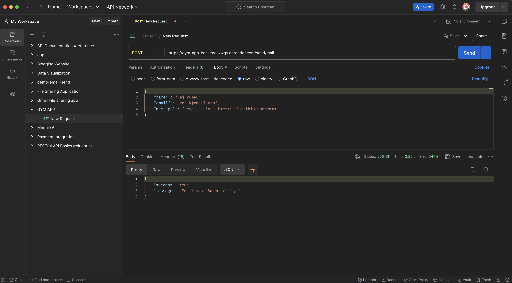

# Gym Application Backend

## Overview

This backend application serves as the server-side component of the Gym Application. It is responsible for handling API requests, sending emails, and interfacing with the frontend. The server is built using Node.js with the Express framework, and it integrates with a mailing service to handle contact form submissions.

## Screenshort (Postman)



## Features

* RESTful API for handling frontend requests.

* CORS configuration to allow communication with the frontend.

* Email functionality to send messages from a contact form.

* Environmental variables for configuration and security.

## Installation

Prerequisites
Ensure you have the following installed:

* Node.js
* npm (Node package manager)

## Steps

1. Clone the repository:
```sh
git clone https://github.com/Lovenoelkujur/gym-app-backend.git
cd gym-application-backend
```

2. Install dependencies:
```sh
npm install
```

3. Create a `.env` file in the root directory and add the following variables:
```env
PORT = your_port_number

FRONTEND_URL = your_frontend_url

EMAIL_USERNAME = your_email_address

EMAIL_PASSWORD = your_email_password

MAIL_RECIVE = recipient_email_address
```

## Usage

### Running the Server

To start the server, run:
```sh
npm start
```

The server will be running at the port specified in the `.env` file. By default, it will log Server is up and running at port <PORT> to the console.

## API Endpoints

### Dummy Route

* Endpoint: `/`

* Method: `GET`

* Description: A dummy route to check if the server is working.

* Response:
```json
{
    "success": true,
    "message": "Code is working fine"
}
```

### Send Mail

* Endpoint: `/send/mail`

* Method: `POST`

* Description: Sends an email using the contact form data.

* Request Body:
```json
{
    "name": "Your Name",
    "email": "your.email@example.com",
    "message": "Your message here"
}
```

* Responses:
```json
{
    "success": true,
    "message": "Email sent Successfully."
}
```

* Error:
```json
{
    "success": false,
    "message": "Please provide all the details."
}
```
```json
{
    "success": false,
    "message": "Something went wrong! Try again later."
}
```

## Project Structure

```plaintext
gym-application-backend/
├── Controllers/
│   └── file.js
├── Routers/
│   └── file.js
├── utils/
│   └── sendEmail.js
├── .env
├── package.json
├── README.md
└── server.js
```

* `server.js`: Entry point of the application.

* `Controllers/file.js`: Handles the business logic for sending emails.

* `Routers/file.js`: Defines the API routes.

* `utils/sendEmail.js`: Configures and exports the email transporter using Nodemailer.

## Dependencies

```json
{
    "cors": "^2.8.5",
    "dotenv": "^16.4.5",
    "express": "^4.19.2",
    "nodemailer": "^6.9.13"
}
```

* `express:` Web framework for Node.js.

* `dotenv`: Loads environment variables from a .env file.

* `cors`: Middleware for enabling CORS.

* `nodemailer`: Module for sending emails.

## License

This project is licensed under the MIT License. See the LICENSE file for more details.